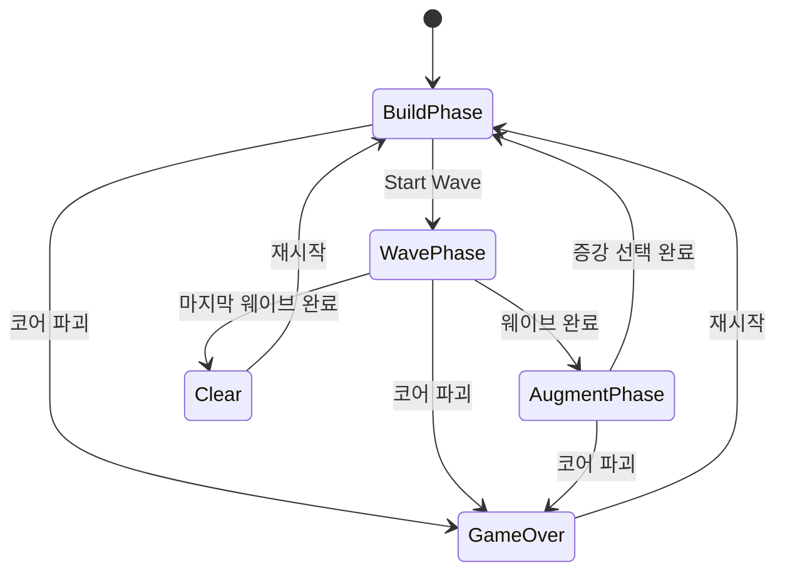
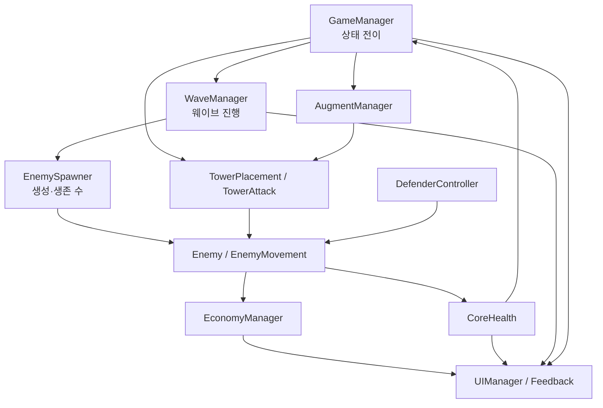
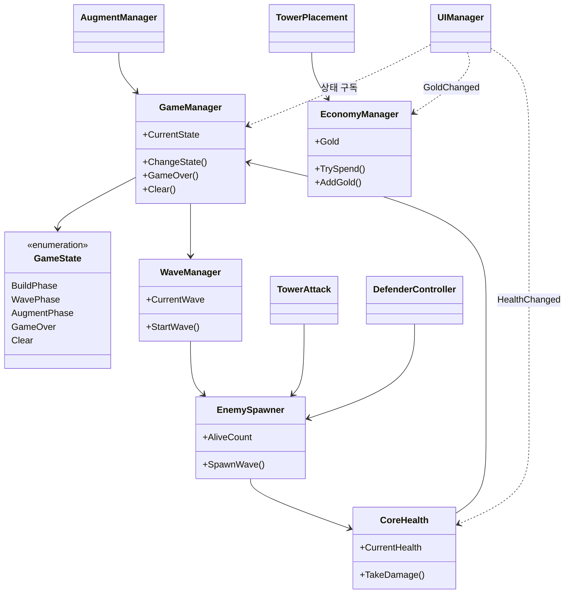
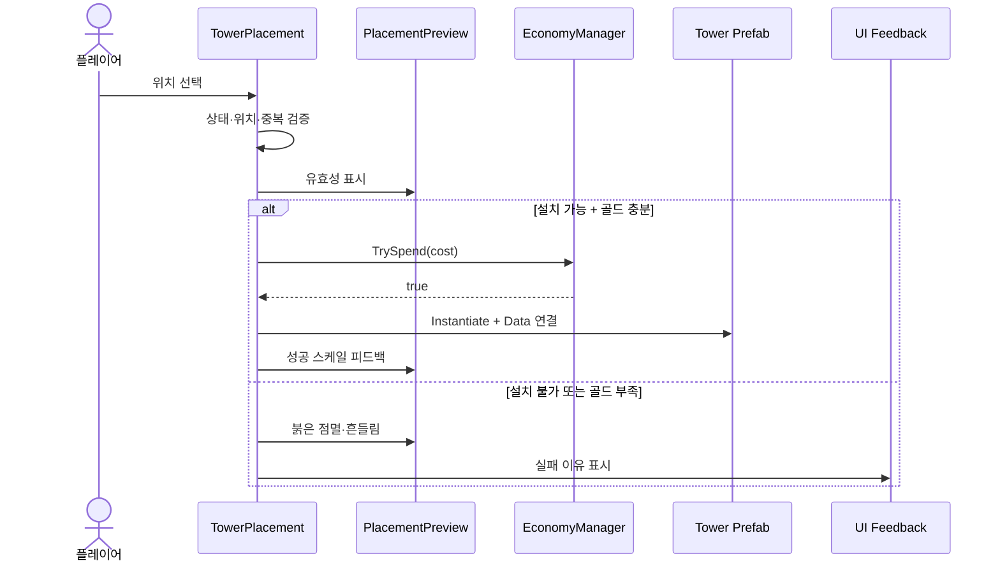
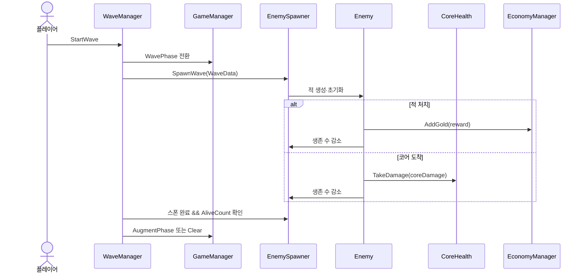

# Augmented Defense 개발·유지보수 가이드

> Unity 6000.0.78f1 · 2D Tower Defense MVP  
> 기준일: 2026-07-15  
> 코드 기준 루트: `Assets/Scripts/`

---

## 0. 문서 목적과 기준

이 문서는 `Augmented Defense`를 다시 열었을 때 전체 코드를 처음부터 읽지 않고도 다음 질문에 답할 수 있도록 만든 유지보수 문서다.

- 게임은 어떤 상태와 시스템으로 구성되는가?
- 한 시스템을 변경하면 어디까지 영향을 받는가?
- 웨이브, 적, 타워, 플레이어 방어자, 증강은 어떤 순서로 데이터를 전달하는가?
- 새 타워·적·웨이브·증강을 추가하려면 무엇을 수정해야 하는가?
- 현재 구조에서 먼저 분리하거나 보강해야 할 지점은 어디인가?

### 정보 구분

| 표기 | 의미 |
|---|---|
| **현재** | 2026-07-07까지 확인된 프로젝트 구조와 구현 내용 |
| **설계 원칙** | 현재 구조를 유지보수하기 위해 지켜야 할 규칙 |
| **확장** | 초기 기획에는 있으나 현재 MVP 이후에 추가할 내용 |

이 문서는 이전 구조 문서와 기획 기록을 통합한 문서다. 실제 저장소의 최신 코드가 변경되면, 이 문서의 `기준일`, 클래스 표, 데이터 흐름, 변경 이력을 함께 갱신한다.

---

## 1. 프로젝트 한눈에 보기

`Augmented Defense`는 타워 설치와 자동 공격에 플레이어가 직접 조작하는 `Player Defender`, 그리고 웨이브 사이의 증강 선택을 결합한 2D 타워 디펜스 MVP다.

### 핵심 플레이 루프

1. `BuildPhase`에서 골드를 사용해 타워를 배치한다.
2. `Start Wave` 입력으로 `WavePhase`를 시작한다.
3. `EnemySpawner`가 `WaveData`에 따라 적을 생성한다.
4. 적은 `EnemyMovement`로 경로를 따라 코어로 이동한다.
5. `TowerAttack`과 `DefenderController`가 적을 공격한다.
6. 적 처치 시 골드를 얻고, 적이 코어에 도착하면 코어 체력이 감소한다.
7. 생존 중인 적과 남은 스폰이 모두 없어지면 웨이브가 끝난다.
8. 마지막 웨이브가 아니면 `AugmentPhase`, 마지막이면 `Clear`로 이동한다.
9. 코어 체력이 0이 되면 즉시 `GameOver`가 된다.



### MVP의 핵심 설계 판단

- 게임 흐름의 권한은 `GameManager`와 `GameState`에 둔다.
- 골드, 코어 체력, 웨이브 진행은 각각 전용 관리자가 소유한다.
- 전투 수치와 웨이브 구성은 `ScriptableObject` 데이터로 분리한다.
- 플레이어 방어자의 로직, 외형 애니메이션, 공격 효과를 서로 다른 컴포넌트로 나눈다.
- 단일 스프라이트를 사용하고 기울기, 펄스, 빔, 사거리 링, 흔들림은 스크립트로 표현한다.
- `DemoBootstrap`은 빠른 데모 씬 구성을 담당하며, 개별 전투 클래스의 책임을 대신하지 않는다.

---

## 2. 전체 시스템 구성



### 시스템별 소유권

| 시스템 | 상태의 소유자 | 외부에 제공해야 하는 것 | 직접 처리하지 말아야 하는 것 |
|---|---|---|---|
| 게임 상태 | `GameManager` | 현재 `GameState`, 상태 변경 이벤트 | 적 생성, 골드 계산, UI 문자열 조립 |
| 경제 | `EconomyManager` | 현재 골드, 지불/획득 API, `GoldChanged` | 타워 생성, 적 사망 연출 |
| 코어 | `CoreHealth` | 현재/최대 체력, 피해 API, `HealthChanged` | 게임 전체 재시작 |
| 웨이브 | `WaveManager` | 현재 웨이브, 시작/완료 판정 | 개별 적의 이동·피해 |
| 적 생성 | `EnemySpawner` | 스폰 실행, `AliveCount` | 웨이브 상태 전이의 최종 결정 |
| 적 | `Enemy`, `EnemyMovement` | 피해·사망·이동·도착 처리 | UI 직접 갱신 |
| 타워 | `TowerPlacement`, `TowerAttack` | 설치 검증, 타겟 탐색, 공격 | 골드 원본 값 직접 수정 |
| 플레이어 | `DefenderController` | 입력·이동·공격 판정 | 외형 코루틴과 빔 렌더링 |
| 증강 | `AugmentManager` | 후보 제시, 선택, 효과 적용 | 웨이브 스폰 |
| UI | `UIManager` 및 피드백 클래스 | 상태 표시와 사용자 피드백 | 게임 규칙의 원본 상태 보유 |

---

## 3. 디렉터리 구조

현재 코드의 기준 루트는 `Assets/Scripts/`이며, 역할별 폴더 구조는 다음과 같다.

```text
Assets/
└─ Scripts/
   ├─ Core/
   │  ├─ GameState.cs
   │  ├─ GameManager.cs
   │  ├─ EconomyManager.cs
   │  ├─ CoreHealth.cs
   │  └─ CoreViewAnimator.cs
   │
   ├─ Wave/
   │  ├─ WaveData.cs
   │  └─ WaveManager.cs
   │
   ├─ Enemy/
   │  ├─ Enemy.cs
   │  ├─ EnemyData.cs
   │  ├─ EnemyMovement.cs
   │  └─ EnemySpawner.cs
   │
   ├─ Tower/
   │  ├─ TowerData.cs
   │  ├─ TowerAttack.cs
   │  ├─ TowerPlacement.cs
   │  ├─ TowerPlacementPreview.cs
   │  └─ TowerRangePreview.cs
   │
   ├─ Player/
   │  ├─ DefenderController.cs
   │  ├─ DefenderViewAnimator.cs
   │  └─ DefenderAttackVfx.cs
   │
   ├─ Augment/
   │  ├─ AugmentData.cs
   │  └─ AugmentManager.cs
   │
   ├─ UI/
   │  ├─ UIManager.cs
   │  ├─ UIButtonStateFeedback.cs
   │  └─ UIHintFeedback.cs
   │
   └─ Demo/
      └─ DemoBootstrap.cs
```

> `ObjectPool`, `DamagePopup`, 개별 `TowerUI`/`WaveUI`/`AugmentUI` 분리는 초기 기획의 확장 후보다. 실제 파일이 추가되기 전까지 현재 구현 목록으로 취급하지 않는다.

### 폴더 배치 규칙

- 두 시스템이 함께 사용하는 범용 게임 상태만 `Core/`에 둔다.
- 특정 도메인에서만 쓰는 클래스는 해당 도메인 폴더에 둔다.
- 순수 데이터 `ScriptableObject`도 사용하는 시스템의 폴더에 둔다.
- 시각 효과가 특정 객체에 강하게 종속되면 그 객체 폴더에 둔다.
- 여러 시스템이 공통으로 사용하는 유틸리티가 실제로 생길 때만 `Utility/`를 만든다.
- `Demo/` 코드는 게임 규칙의 필수 의존성이 되어서는 안 된다.

---

## 4. 핵심 클래스 관계



다이어그램의 메서드 이름은 역할을 설명하기 위한 대표 API다. 실제 시그니처가 바뀌면 호출부보다 먼저 이 문서를 갱신한다.

---

## 5. Core 시스템

### 5.1 `GameState`

게임에서 허용되는 행동을 결정하는 단일 상태 열거형이다.

| 상태 | 의미 | 허용되는 주요 행동 |
|---|---|---|
| `MainMenu` | 시작 전 화면 | 게임 시작 |
| `BuildPhase` | 웨이브 준비 | 타워 배치, 웨이브 시작 |
| `WavePhase` | 전투 진행 | 플레이어 이동·공격, 타워 자동 공격 |
| `AugmentPhase` | 증강 선택 | 증강 선택, 다음 준비 단계 전환 |
| `GameOver` | 코어 파괴 | 재시작 |
| `Clear` | 마지막 웨이브 완료 | 결과 확인, 재시작 |

#### 불변 조건

- 상태 변경은 `GameManager`를 통한다.
- 입력 클래스가 임의로 상태 값을 변경하지 않는다.
- `GameOver`와 `Clear`에서는 전투 시간이 멈춘다.
- 상태 전환 시 UI는 값을 추측하지 않고 변경 이벤트를 기준으로 갱신한다.

### 5.2 `GameManager`

`GameManager`는 싱글턴으로 게임의 최상위 상태를 관리한다.

현재 책임:

- 현재 `GameState` 보유
- Build → Wave → Augment → Build 상태 전환 조정
- 게임 오버와 클리어 진입
- `GameOver`/`Clear`에서 `Time.timeScale = 0` 처리
- 상태 변경을 다른 시스템에 알림

유지보수 원칙:

- `GameManager`에는 “언제 상태가 바뀌는가”만 둔다.
- 적 생성, 골드 차감, 타워 공격, UI 문구는 전용 클래스에 둔다.
- 씬 재시작 시 `Time.timeScale`을 반드시 1로 복구한다.
- 일시정지 상태가 추가되면 이전 상태를 보존하는 별도 필드를 둔다.

### 5.3 `EconomyManager`

초기 골드는 **120**이며 골드 원본 값은 이 클래스만 변경한다.

핵심 흐름:

```text
적 사망 → AddGold(보상) → GoldChanged → UI 갱신
타워 배치 요청 → TrySpend(비용) → 성공 시 생성 / 실패 시 피드백
```

권장 공개 API:

```csharp
bool TrySpend(int amount);
void AddGold(int amount);
event Action<int> GoldChanged;
```

골드를 사용하는 기능은 `Gold -= cost`처럼 직접 수정하지 않고 `TrySpend`의 결과로 진행 여부를 결정한다.

### 5.4 `CoreHealth`

현재 체력과 최대 체력을 소유한다.

- 적이 마지막 웨이포인트에 도착하면 피해를 받는다.
- 체력 변경 후 `HealthChanged`를 발생시킨다.
- 체력이 0 이하가 되면 한 번만 `GameManager.GameOver()`를 호출한다.
- 시각적 흔들림·점멸은 `CoreViewAnimator`에 위임한다.

### 5.5 `CoreViewAnimator`

코어 피해와 상태 변화의 시각 피드백을 담당한다. 체력 수치나 게임 상태를 직접 변경하지 않는다.

---

## 6. Wave와 Enemy 시스템

### 6.1 `WaveData`

`ScriptableObject`로 웨이브 구성을 코드 밖에서 편집한다.

현재 확인된 핵심 데이터:

- `enemyCount`
- `enemyData`

서로 다른 적을 한 웨이브에 섞을 때는 다음 단계에서 `WaveEntry` 목록으로 확장한다.

```csharp
[Serializable]
public struct WaveEntry
{
    public EnemyData enemyData;
    public int count;
    public float spawnInterval;
}
```

이 구조를 도입하면 `WaveManager`나 `EnemySpawner`에 적 종류별 분기문을 늘리지 않고 혼합 웨이브를 만들 수 있다.

### 6.2 `WaveManager`

웨이브 인덱스와 진행 상태를 관리한다.

1. `StartWave()` 호출을 받는다.
2. `GameManager`를 `WavePhase`로 전환한다.
3. 현재 `WaveData`를 `EnemySpawner`에 전달한다.
4. 스폰 완료와 `EnemySpawner.AliveCount == 0`을 함께 확인한다.
5. 다음 웨이브가 있으면 `AugmentPhase`, 없으면 `Clear`로 전환한다.

#### 중요한 완료 조건

`AliveCount == 0`만 확인하면 첫 적이 나오기 전 웨이브가 끝날 수 있다. 반드시 다음 두 조건을 함께 확인한다.

```text
모든 스폰 요청이 끝남
AND
AliveCount == 0
```

### 6.3 `EnemySpawner`

- `WaveData`를 읽어 일정 간격으로 적을 생성한다.
- 생성한 적에 `EnemyData`, 경로, 사망/도착 콜백을 연결한다.
- 현재 살아 있는 적 수를 `AliveCount`로 제공한다.
- 적이 죽거나 코어에 도착할 때 생존 수가 정확히 한 번 감소하도록 보장한다.

### 6.4 `EnemyData`

적의 정적 전투 수치를 보관하는 `ScriptableObject`다.

대표 데이터:

- 최대 체력
- 이동속도
- 코어 도착 피해
- 처치 골드
- 표시용 색상 또는 프리팹

런타임 체력, 현재 둔화량, 현재 웨이포인트처럼 매 개체마다 달라지는 값은 데이터 에셋에 저장하지 않는다.

### 6.5 `Enemy`

적 개체의 런타임 상태를 담당한다.

- `EnemyData`로 초기화
- 피해 수신
- 체력 0 이하에서 사망 처리
- 처치 골드 지급
- 중복 사망 방지

### 6.6 `EnemyMovement`

- 지정된 웨이포인트를 순서대로 이동한다.
- 마지막 지점에서 `CoreHealth`에 피해를 준다.
- 코어 도착과 사망이 동시에 처리되지 않게 종료 상태를 한 번만 확정한다.
- 이후 둔화·빙결을 추가할 수 있도록 기본 속도와 최종 속도를 분리한다.

권장 속도 계산:

```text
finalSpeed = baseSpeed × speedMultiplier
```

---

## 7. Tower 시스템

### 7.1 `TowerData`

현재 기본/둔화/체인 역할의 타워 데이터를 표현한다.

대표 데이터:

- 타워 타입 (`Basic`, `Slow`, `Chain`)
- 비용
- 공격력
- 공격 간격 또는 공격속도
- 사거리
- 둔화 수치 또는 체인 횟수처럼 타입별 추가 값
- 프리팹과 표시 정보

타워 종류가 늘어나면 하나의 거대한 `switch`에 모든 효과를 넣지 않는다. 공통 수치는 `TowerData`, 공격 방식은 전략 컴포넌트로 분리하는 방향이 적합하다.

### 7.2 `TowerPlacement`

배치 요청의 조정자다.

검증 순서:

1. 현재 상태가 `BuildPhase` 또는 `AugmentPhase`인지 확인한다.
2. 마우스 위치를 월드 좌표로 변환한다.
3. 맵 범위, 경로, 기존 타워와의 중복 여부를 확인한다.
4. `EconomyManager.TrySpend(cost)`를 호출한다.
5. 성공하면 실제 타워를 생성하고, 실패하면 원인에 맞는 피드백을 재생한다.

> 위치가 유효한지 확인하기 전에 골드를 차감하지 않는다. 생성 실패 후 환불하는 구조보다 검증 후 한 번만 결제하는 구조가 안전하다.

### 7.3 `TowerPlacementPreview`

배치 고스트를 담당한다.

- 마우스 위치 추적
- 설치 가능 시 녹색 또는 노란색
- 설치 불가 시 붉은색
- 설치 실패 시 약 0.15초 흔들림과 붉은 점멸
- 설치 성공 시 약 0.15초 스케일 업 피드백

배치 가능 여부의 최종 판정은 `TowerPlacement`가 소유하고, Preview는 판정 결과를 표현한다.

### 7.4 `TowerRangePreview`

현재 배치 또는 선택 대상의 사거리를 원으로 표시한다. 사거리 판정 로직을 별도로 계산하지 말고 `TowerData` 또는 `TowerAttack`이 사용하는 동일한 값을 전달받는다.

### 7.5 `TowerAttack`

1. 사거리 안의 활성 적을 찾는다.
2. 현재 타겟팅 규칙에 따라 대상을 선택한다.
3. 공격 쿨다운이 끝났는지 확인한다.
4. 피해 또는 타입별 효과를 적용한다.
5. 공격 시각 효과를 요청한다.

현재는 가까운 적 탐색을 기준으로 동작하며, 확장 시 타겟 선택을 다음 인터페이스로 분리할 수 있다.

```csharp
public interface ITargetingStrategy
{
    Enemy SelectTarget(Vector3 origin, float range, IReadOnlyList<Enemy> candidates);
}
```

후보 전략:

- 가장 가까운 적
- 경로를 가장 많이 진행한 적
- 체력이 가장 높은 적
- 상태 이상이 없는 적

---

## 8. Player Defender 시스템

플레이어 방어자는 타워와 달리 직접 조작하는 기동 전투 유닛이다.

### 현재 데모 설정

| 항목 | 값 |
|---|---:|
| 초기 위치 | `(-4.5, -2.5, 0)` |
| 크기 | `0.55 × 0.55` |
| 입력 | `WASD`, `Space` |
| 공격 쿨다운 | `0.28초` |
| 공격 대상 | 사거리 안의 가장 가까운 적 |

### 8.1 `DefenderController`

게임 로직만 담당한다.

- 이동 입력 수집과 위치 변경
- 공격 입력과 쿨다운 처리
- 가장 가까운 적 탐색
- 피해 적용
- `DefenderViewAnimator`와 `DefenderAttackVfx`에 표현 요청

### 8.2 `DefenderViewAnimator`

단일 스프라이트에 코드 기반 피드백을 준다.

- 이동 방향으로 약 3~6도 기울기
- 정지 후 약 0.12초 안에 정면 복귀
- 공격 성공 시 약 0.06초 동안 1.08배 펄스
- 대상 없이 공격했을 때 짧은 펄스와 사거리 링

확인된 주요 메서드:

```text
SetMoveInput
PlayAttackPulse
PlayNoTargetPulse
```

### 8.3 `DefenderAttackVfx`

플레이어와 피격 대상 사이의 짧은 라인/빔을 표시한다. 빔 지속시간은 데모 기준 약 0.08초다. 이 클래스는 피해를 적용하지 않는다.

### 표현 분리 원칙

```text
DefenderController  = 공격이 성공했는가?
DefenderViewAnimator = 몸체가 어떻게 반응하는가?
DefenderAttackVfx    = 공격 경로를 어떻게 보여주는가?
```

프레임 애니메이션이 꼭 필요한 행동이 생기기 전까지는 단일 스프라이트와 코드 기반 피드백을 유지한다.

---

## 9. Augment 시스템

### 9.1 `AugmentData`

증강의 표시 정보와 효과 파라미터를 데이터로 보관한다.

권장 필드:

- 고유 ID
- 이름과 설명
- 분류: 타워 / 속성 / 코어 / 경제
- 등급
- 중복 가능 여부와 최대 중첩
- 효과 타입과 수치

표시용 이름을 저장 키로 사용하지 않는다. 이름이 바뀌어도 저장 데이터와 중첩 판정이 유지되도록 고유 ID를 사용한다.

### 9.2 `AugmentManager`

- 웨이브 종료 후 후보를 만든다.
- 후보 중 하나를 선택받는다.
- 중복과 최대 중첩을 검증한다.
- 효과를 대상 시스템에 적용한다.
- 적용 완료 후 다음 `BuildPhase`로 전환한다.

### 권장 확장 구조

수치 증강이 늘어나면 `AugmentManager`의 `switch`가 빠르게 커진다. 효과 적용을 다음과 같이 분리한다.

```csharp
public interface IAugmentEffect
{
    void Apply(AugmentContext context, float value);
}
```

`AugmentContext`는 `EconomyManager`, `CoreHealth`, 타워 레지스트리처럼 효과 적용에 필요한 제한된 참조만 제공한다.

---

## 10. UI와 Demo 시스템

### 10.1 `UIManager`

HUD와 상태별 패널을 갱신한다.

- 골드
- 코어 체력
- 현재 웨이브
- 현재 게임 상태
- 게임 오버 / 클리어
- 증강 선택 영역

UI는 매 프레임 값을 가져오는 방식보다 `GoldChanged`, `HealthChanged`, 상태 변경 이벤트를 구독해 갱신하는 방식을 우선한다.

### 10.2 `UIButtonStateFeedback`

버튼의 사용 가능 여부와 클릭 피드백을 표현한다. 버튼이 비활성인 이유를 게임 규칙으로 다시 판단하지 않고, 해당 시스템이 제공한 상태를 표시한다.

### 10.3 `UIHintFeedback`

- 첫 이동 후 `WASD` 안내를 약화한다.
- 첫 공격 후 `Space` 안내를 약화한다.
- 첫 타워 배치 성공 후 배치 힌트를 약화한다.

힌트 완료 여부를 저장 기능과 연결할 경우, UI 오브젝트의 활성 상태가 아니라 별도 사용자 설정 데이터로 보관한다.

### 10.4 `DemoBootstrap`

빈 씬에서도 MVP 구성 요소를 빠르게 생성하고 연결하는 데모 지원 클래스다.

유지보수 규칙:

- 실제 전투 규칙을 `DemoBootstrap` 안에 구현하지 않는다.
- 런타임에 만든 값과 프리팹의 Inspector 기본값이 충돌하지 않게 한다.
- 정식 씬 구성이 완성되면 부트스트랩 사용 여부를 명시적으로 선택한다.
- 테스트 편의를 위한 자동 탐색은 허용하되, 프로덕션 의존성은 직렬화 참조 또는 명시적 초기화로 옮긴다.

---

## 11. 핵심 데이터 흐름

### 11.1 타워 배치



### 11.2 웨이브와 적 생명주기



### 11.3 타워·플레이어 공격

```text
입력 또는 공격 주기 도달
→ 사거리 안 후보 수집
→ 타겟 전략으로 대상 선택
→ Enemy에 피해 적용
→ 공격 시각 효과 요청
→ Enemy 체력 0 이하라면 사망 처리
→ EconomyManager 보상 지급
→ EnemySpawner AliveCount 감소
```

공격자와 피격자는 직접 UI를 갱신하지 않는다. 전투 결과로 변경된 상태의 소유자가 이벤트를 발행하고 UI가 이를 구독한다.

---

## 12. 이벤트와 참조 관리

### 권장 이벤트

| 발행자 | 이벤트 | 주요 구독자 |
|---|---|---|
| `GameManager` | `GameStateChanged` | `UIManager`, 입력/배치 시스템 |
| `EconomyManager` | `GoldChanged` | `UIManager`, 타워 선택 UI |
| `CoreHealth` | `HealthChanged` | `UIManager`, `CoreViewAnimator` |
| `WaveManager` | `WaveChanged` | `UIManager` |
| `Enemy` 또는 Spawner | 적 제거 알림 | `WaveManager`, 통계 시스템 |
| `AugmentManager` | 증강 적용 알림 | UI, 빌드 요약 |

### 구독 생명주기

```csharp
private void OnEnable()
{
    source.Changed += HandleChanged;
}

private void OnDisable()
{
    source.Changed -= HandleChanged;
}
```

- 람다로 구독한 뒤 다른 람다로 해제하지 않는다.
- 파괴될 수 있는 객체가 정적 이벤트를 계속 구독하지 않게 한다.
- 이벤트 처리 함수에서 다시 원본 상태를 수정해 순환 호출을 만들지 않는다.

### 참조 우선순위

1. Inspector의 `[SerializeField] private` 참조
2. 생성 시 명시적인 `Initialize(...)`
3. 제한된 싱글턴 접근
4. 장면 탐색은 데모나 초기 연결 보조에만 사용

Unity 6에서는 순서가 필요 없는 탐색에 `FindAnyObjectByType<T>()`를 사용할 수 있지만, 반복적인 런타임 탐색을 정상적인 의존성 주입 방식으로 삼지 않는다.

---

## 13. 데이터 기반 설계 규칙

### `ScriptableObject`에 둘 값

- 여러 개체가 공유하는 기본 수치
- Inspector에서 밸런싱할 값
- 프리팹, 아이콘, 설명 같은 정적 자산 참조
- 웨이브 편성

### 런타임 컴포넌트에 둘 값

- 현재 체력
- 남은 공격 쿨다운
- 현재 타겟
- 현재 웨이포인트 인덱스
- 현재 적용된 둔화와 상태 이상
- 해당 판에서 쌓인 증강 결과

### 금지할 패턴

- 런타임 중 원본 `ScriptableObject`의 공격력이나 체력을 직접 변경
- 표시용 이름을 타입 판별이나 저장 키로 사용
- 프리팹별로 같은 밸런스 값을 중복 입력
- 데이터 에셋이 Scene 오브젝트를 영구 참조

증강으로 수치가 변할 때는 원본 데이터가 아니라 런타임 스탯 복사본 또는 수정자 목록을 변경한다.

---

## 14. 기능 추가 절차

### 14.1 새 타워 추가

1. `TowerData` 에셋을 만든다.
2. 비용, 공격력, 공격 간격, 사거리, 역할별 값을 설정한다.
3. 공통 타워 프리팹 또는 전용 공격 컴포넌트를 연결한다.
4. 타워 선택 UI에 데이터 에셋을 등록한다.
5. `TowerPlacementPreview`가 같은 프리팹·사거리 값을 표시하는지 확인한다.
6. 골드 부족, 중복 위치, 경로 위 설치를 각각 테스트한다.
7. 공격 대상 없음, 대상 사망 직전, 사거리 이탈 상황을 테스트한다.

새 타입 때문에 `TowerAttack`의 조건문이 크게 늘어나면 공격 전략 분리 시점이다.

### 14.2 새 적 추가

1. `EnemyData` 에셋을 만든다.
2. 체력, 이동속도, 코어 피해, 골드 보상을 설정한다.
3. 공통 적 프리팹에 데이터를 주입하거나 전용 프리팹을 연결한다.
4. `WaveData`에 배치한다.
5. 사망과 코어 도착에서 `AliveCount`가 각각 한 번만 줄어드는지 확인한다.
6. 둔화·체인 공격과의 상호작용을 확인한다.

### 14.3 새 웨이브 추가

1. `WaveData` 에셋을 만든다.
2. 적 종류, 수량, 간격을 설정한다.
3. `WaveManager`의 웨이브 목록에 순서대로 등록한다.
4. 이전 웨이브 완료 후 올바른 상태로 이동하는지 확인한다.
5. 마지막 인덱스라면 `Clear`로 가는지 확인한다.

### 14.4 새 증강 추가

1. 고유 ID가 있는 `AugmentData`를 만든다.
2. 중복 가능 여부와 최대 중첩을 정한다.
3. 효과 적용 클래스를 구현하거나 기존 효과 타입을 연결한다.
4. `AugmentManager` 후보 풀에 등록한다.
5. 카드 설명과 실제 계산 순서가 일치하는지 확인한다.
6. 같은 증강의 중첩, 최대치, 저장·재시작 상황을 테스트한다.

---

## 15. 현재 구조의 위험 지점

### 15.1 `GameManager` 비대화

징후:

- UI 문구, 골드, 적 스폰, 타워 생성 코드가 들어가기 시작함
- 다른 클래스가 모든 작업을 `GameManager`에 요청함

대응:

- 상태 전환만 남기고 도메인별 관리자에 위임한다.
- 읽기 전용 상태와 명령 API를 구분한다.

### 15.2 `AliveCount` 경쟁 조건

적 생성 코루틴이 시작되기 전에 0을 읽거나, 사망과 도착 양쪽에서 두 번 감소할 수 있다. `IsSpawning`과 개체별 종료 플래그를 둔다.

### 15.3 `Time.timeScale = 0`

일반 `WaitForSeconds`와 물리 업데이트가 멈춘다. 게임 오버 패널 애니메이션처럼 계속 재생해야 하는 UI는 `WaitForSecondsRealtime` 또는 unscaled time을 사용한다.

### 15.4 타겟 탐색 비용

각 타워가 매 프레임 전체 적을 검색하면 타워와 적 수의 곱만큼 비용이 증가한다.

개선 순서:

1. 공격 시점에만 탐색
2. 활성 적 레지스트리 공유
3. `Physics2D.OverlapCircleNonAlloc` 또는 재사용 버퍼
4. 필요할 때 공간 분할

### 15.5 데이터 에셋 런타임 변경

증강이 `TowerData` 원본을 수정하면 다음 플레이나 다른 타워에도 값이 남을 수 있다. 런타임 스탯을 별도로 생성한다.

### 15.6 Demo와 실제 씬의 이중 설정

`DemoBootstrap`과 Inspector가 같은 객체를 만들면 중복 매니저나 중복 UI가 생길 수 있다. 부트스트랩이 활성인 씬과 수동 구성 씬을 구분한다.

---

## 16. 향후 확장 포인트

### 1순위 — 현재 MVP 안정화

- 웨이브 완료 조건 명시화 (`IsSpawning` + `AliveCount`)
- 적 활성 목록 또는 `EnemyRegistry` 도입
- 타워 런타임 스탯과 원본 `TowerData` 분리
- 증강 고유 ID와 중첩 규칙 확립
- 이벤트 구독·해제 통일
- EditMode 및 PlayMode 핵심 테스트 추가

### 2순위 — 게임성 확장

- 혼합 웨이브용 `WaveEntry[]`
- 타겟팅 전략 (`Nearest`, `First`, `Strongest`)
- 상태 이상 시스템 (`Slow`, `Freeze`, `Shock`)
- 증강 효과 인터페이스
- 타워 업그레이드와 판매
- 보스 패턴과 특수 적

### 3순위 — 성능과 제작 효율

- 적, 투사체, 데미지 팝업 오브젝트 풀링
- 중앙 `DamageSystem` 또는 피해 컨텍스트
- 디버그 오버레이: 활성 적, 현재 상태, 웨이브 인덱스
- 밸런스 데이터 검증기
- 에셋 자동 등록 또는 Addressables 검토

### 4순위 — 제품화

- 설정과 힌트 진행 저장
- 런 기록 및 선택 증강 요약
- 여러 맵과 경로
- 사운드·접근성 옵션
- 메인 메뉴, 일시정지, 결과 화면 완성

---

## 17. 테스트 전략

Codex 작업 범위는 코드와 테스트 파일 생성까지로 두고, Unity Editor 실행 결과는 사용자가 직접 확인한다. 기본 수정 범위는 `Assets/Scripts`와 `Assets/Tests`이며, `ProjectSettings`, Scene, Prefab은 요청 없이 변경하지 않는다.

### EditMode 테스트 후보

- 골드가 부족할 때 `TrySpend`가 false이며 값이 변하지 않음
- 골드가 충분할 때 한 번만 차감됨
- 체력이 0 미만으로 내려가도 게임 오버가 한 번만 발생함
- 증강 중첩 한도 계산
- 타겟팅 전략이 기대한 적을 선택함
- 최종 이동속도 수정자 계산

### PlayMode 테스트 후보

- Build → Wave → Augment → Build 상태 전이
- 마지막 웨이브 후 Clear 전이
- 적 처치와 코어 도착 모두 `AliveCount` 정리
- 잘못된 위치에서 타워 미생성·골드 유지
- GameOver에서 이동·공격·배치 입력 차단
- 재시작 후 `Time.timeScale == 1`

### 수동 점검 체크리스트

- [ ] 빈 씬에서 `DemoBootstrap` 구성이 중복 없이 생성된다.
- [ ] 초기 골드는 120으로 표시된다.
- [ ] Build/Augment 외 상태에서 타워가 설치되지 않는다.
- [ ] 설치 실패 원인에 맞는 시각 피드백이 나온다.
- [ ] 타워 사거리 표시와 실제 탐색 범위가 일치한다.
- [ ] Defender가 대각선 이동 시 과도하게 빨라지지 않는다.
- [ ] 대상 없는 공격과 성공 공격 피드백이 구분된다.
- [ ] 적 처치 보상이 한 번만 들어온다.
- [ ] 코어 도착 적이 처치 보상도 함께 주지 않는다.
- [ ] 마지막 적 처리 후 다음 상태로 한 번만 이동한다.
- [ ] GameOver/Clear 후 전투가 멈추고 재시작은 정상 동작한다.

---

## 18. 코딩 규칙

### 필드 공개 범위

Inspector에서 조정할 값은 공개 필드 대신 다음 형태를 기본으로 한다.

```csharp
[SerializeField] private float attackCooldown = 0.28f;

public float AttackCooldown => attackCooldown;
```

- 내부 구현 값: `private`
- Inspector 연결: `[SerializeField] private`
- 외부 읽기만 필요: 읽기 전용 프로퍼티
- 외부 변경이 필요: 의미가 드러나는 메서드
- UI라고 해서 무조건 `public`으로 두지 않는다.

### 클래스 책임

- 한 클래스가 변경되는 이유는 하나가 되게 한다.
- `Controller`는 판정과 명령, `View`/`Vfx`는 표현을 담당한다.
- Manager끼리 서로를 양방향으로 직접 호출하지 않는다.
- `Update()`에는 입력 감지나 짧은 상태 확인만 두고 반복 검색과 할당을 줄인다.
- Coroutine 시작 전 기존 Coroutine 중복 실행 여부를 확인한다.

### 주석

“무엇을 하는 코드인가”보다 “왜 이 순서와 조건이 필요한가”를 기록한다.

좋은 예:

```csharp
// 마지막 적이 생성되기 전 AliveCount가 0일 수 있으므로
// 스폰 완료와 생존 수를 함께 확인한다.
```

---

## 19. 변경 영향도 표

| 변경 내용 | 우선 확인 파일 | 함께 확인할 시스템 |
|---|---|---|
| 게임 단계 추가 | `GameState`, `GameManager` | UI, 입력, 배치, 시간 정지 |
| 초기 골드 변경 | `EconomyManager` | HUD, 데모 밸런스 |
| 웨이브 완료 규칙 변경 | `WaveManager`, `EnemySpawner` | 적 사망/도착, 증강 전환 |
| 적 이동속도 계산 변경 | `EnemyMovement`, `EnemyData` | 둔화 증강, 웨이포인트 |
| 타워 사거리 변경 | `TowerData`, `TowerAttack` | `TowerRangePreview`, 배치 고스트 |
| 타워 비용 변경 | `TowerData` | `EconomyManager`, UI 버튼 상태 |
| Defender 공격 변경 | `DefenderController` | ViewAnimator, AttackVfx, 힌트 |
| 증강 적용 방식 변경 | `AugmentManager`, `AugmentData` | 타워 런타임 스탯, 코어, 경제 |
| UI 이벤트 변경 | 발행 시스템, `UIManager` | 구독 해제, 초기 표시 |
| 데모 자동 구성 변경 | `DemoBootstrap` | 씬의 수동 배치 객체 |

---

## 20. 유지보수 작업 순서

버그 수정이나 기능 추가 시 다음 순서를 권장한다.

1. 문제가 발생하는 `GameState`와 재현 조건을 적는다.
2. 상태의 실제 소유 클래스를 찾는다.
3. 데이터 문제인지 런타임 로직 문제인지 구분한다.
4. 변경할 공개 API와 영향을 받는 구독자를 확인한다.
5. 가장 작은 범위로 코드를 수정한다.
6. 자동 테스트가 가능하면 `Assets/Tests`에 회귀 테스트를 추가한다.
7. Unity Editor에서 수동 체크리스트를 실행한다.
8. 클래스 관계나 데이터 흐름이 바뀌면 이 문서를 갱신한다.

### 완료 정의

- 컴파일 오류가 없다.
- 상태 전이가 한 번만 일어난다.
- 골드·체력·생존 수가 중복 변경되지 않는다.
- UI는 실제 상태와 일치한다.
- GameOver/Clear/재시작 경로가 깨지지 않는다.
- 새 콘텐츠가 코드의 타입 분기 증가 없이 데이터 등록만으로 가능한지 검토했다.

---

## 21. 용어 정리

| 용어 | 의미 |
|---|---|
| Build Phase | 타워를 설치하고 웨이브를 준비하는 단계 |
| Wave Phase | 적 스폰과 전투가 진행되는 단계 |
| Augment Phase | 웨이브 사이에서 증강을 선택하는 단계 |
| AliveCount | 현재 생성되어 아직 종료 처리되지 않은 적 수 |
| Static Data | `ScriptableObject`에 저장되는 공유 기본값 |
| Runtime State | 현재 체력·쿨다운처럼 플레이 중 변하는 개체별 값 |
| Controller | 입력과 게임 판정을 담당하는 컴포넌트 |
| View / VFX | 수치를 바꾸지 않고 시각적 결과를 표현하는 컴포넌트 |
| DemoBootstrap | 데모 실행에 필요한 객체를 자동 구성하는 지원 코드 |

---

## 22. 문서 변경 이력

| 날짜 | 변경 내용 |
|---|---|
| 2026-07-15 | 기존 기획서와 2026-07-07 구현 구조를 통합해 유지보수 가이드 최초 작성 |

---

## 부록 A. 빠른 구조 요약

```text
GameManager
├─ 현재 게임 상태를 결정한다.
├─ WaveManager가 웨이브의 시작과 종료를 판단한다.
│  └─ EnemySpawner가 적 생성과 AliveCount를 관리한다.
├─ EconomyManager가 모든 골드 변경을 소유한다.
├─ CoreHealth가 0이 되면 GameOver로 전환한다.
├─ TowerPlacement는 상태·위치·골드를 검증한 뒤 타워를 만든다.
├─ TowerAttack과 DefenderController가 Enemy에 피해를 준다.
├─ AugmentManager가 웨이브 사이의 효과를 적용한다.
└─ UIManager는 이벤트를 구독해 현재 상태를 표시한다.
```

## 부록 B. 다음 리팩터링 권장 순서

1. 웨이브 종료 조건을 `IsSpawning && AliveCount` 기준으로 명시한다.
2. 적 종료 처리를 사망/코어 도착 공통 경로로 합친다.
3. 타워의 원본 데이터와 런타임 스탯을 분리한다.
4. 활성 적 레지스트리와 타겟팅 전략을 도입한다.
5. 증강 효과를 인터페이스 기반으로 분리한다.
6. 적과 반복 효과에 오브젝트 풀을 적용한다.
7. 핵심 상태 전이에 PlayMode 회귀 테스트를 추가한다.
